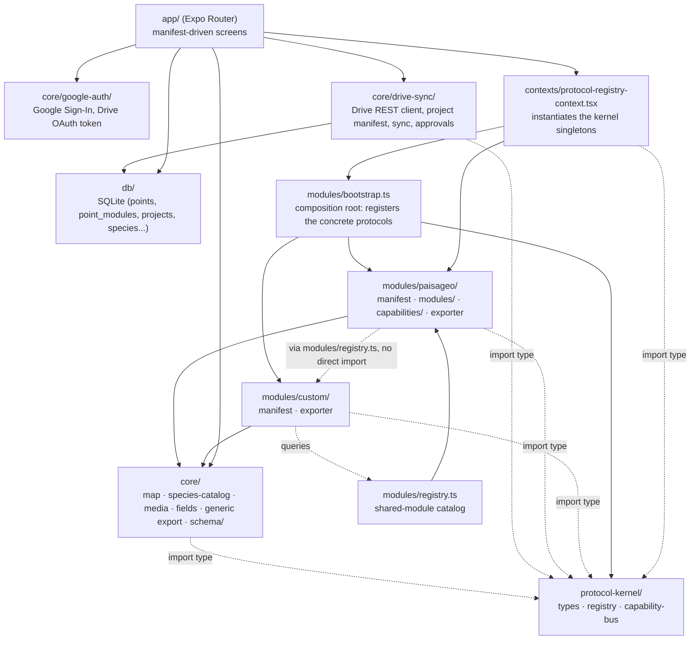

# 01. Architecture

## The four layers

Nomos follows a one-way dependency rule, enforced in the code itself and verified by directly reading the code's imports:



> Arrows = import direction (`A --> B` = "A imports from B"). This diagram and
> the rules below are checked automatically by
> `protocol-kernel/__tests__/layer-rules.test.ts` (a data table of "layer X
> cannot import from layer Y" rows, not scattered conditionals) and, as a
> second barrier at edit time, by `@typescript-eslint/no-restricted-imports`
> in `eslint.config.js`.

Inviolable rules (verified against the code, not just stated):

1. **`core/` only imports from `protocol-kernel/` via `import type`, never by value.** `core/schema/` (`module-schema.ts`, `dynamic-columns.ts` — includes `buildColumns`, used by `core/export/generic-export-engine.ts`) only references kernel types (`ModuleSchema`, `ColumnPlan`, etc.), never values. `core/drive-sync/point-submission-service.ts` and `project-sync-service.ts` follow the same rule, importing only `type { ProtocolRegistry }`. `core/` never imports from `modules/<protocol>/` or `app/` in any form. One thing this rule does *not* cover: `core/drive-sync/` (unlike the rest of `core/`) imports directly from `db/queries/*` — `project-drive-service.ts`, `project-sync-service.ts`, `point-submission-service.ts`, and `reference-data-sync-service.ts` all read/write projects, points, project members, and custom protocols through the query layer. This edge isn't in `layer-rules.test.ts`'s rule table, so it isn't a violation, but it is a real dependency worth knowing about — collaboration sync is the one place `core/` talks to SQLite directly instead of leaving that to `app/`. `core/google-auth/` has no `db/` dependency at all. See [12_COLLABORATION.md](12_COLLABORATION.md).
2. **`protocol-kernel/` never imports from `core/`, `modules/<protocol>/`, or `app/`, in any form.** The kernel (`types.ts`, `registry.ts`, `capability-bus.ts`) doesn't know any concrete protocol — that's the job of the composition root, `modules/bootstrap.ts` (see next section). `AudioNote`, `MediaFiles`, and `ProtocolExporter` are defined exactly once, in `protocol-kernel/types.ts` (`ProtocolExporter` there already includes `extractMedia`); `core/export/types.ts` just re-exports the same types (`export type {...} from "@/protocol-kernel/types"`) — this eliminates the type cycle that used to exist from the same interface being duplicated across the two files.
3. **Protocols can import from `core/` and `protocol-kernel/`, never directly from each other.** `modules/paisageo/services/export.ts` imports `buildProtocolExportPlan` from `core/export/generic-export-engine`; no file in `modules/custom/` imports from `modules/paisageo/` directly (verified by direct code search and enforced by a test, see item 4). The static check for this rule is permanent and generalized to any number of protocols: `protocol-kernel/__tests__/layer-rules.test.ts`.
4. **Cross-protocol communication goes through the `modules/registry.ts` aggregator, not through `CapabilityBus`.** The `CapabilityBus` still exists in the kernel and is used to expose a protocol's scientific capabilities to the UI (e.g. `kuchler.classifyVegetation`, `landscape.generateName`, both from PAISAGEO), but today no protocol consumes another protocol's capability through it — when custom needs to reuse an entire PAISAGEO scientific module, it does so through the `modules/registry.ts` catalog (`getSharedModule`, `listBuilderAttachableModules`), detailed in [06_KERNEL_AND_CAPABILITIES.md](06_KERNEL_AND_CAPABILITIES.md).

## Where the kernel is actually instantiated

The diagram above has a layer that earlier planning didn't call out: `contexts/protocol-registry-context.tsx` is the real wiring point between the kernel and the React tree. It's there, not somewhere inside the kernel, that:

```typescript
// contexts/protocol-registry-context.tsx
const globalRegistry = bootstrapProtocols();
const globalBus = globalRegistry.getBus();
const globalRendererRegistry = createModuleRendererRegistry();
for (const b of paisageoRendererBindings) {
  globalRendererRegistry.register(b);
}
// Read-only variant used by the point-details screen — registered
// separately from globalRendererRegistry so the interactive collection
// renderers stay completely untouched.
const globalReadOnlyRendererRegistry = createModuleReadOnlyRendererRegistry();
for (const b of paisageoReadOnlyRendererBindings) {
  globalReadOnlyRendererRegistry.register(b);
}
```

In other words: `bootstrapProtocols()` (the composition root, `modules/bootstrap.ts` — deliberately outside the kernel, because it's the only place authorized to know `paisageoManifest` and `customManifest` by name) registers the manifests; and PAISAGEO's UI *renderers* (`modules/paisageo/renderers.ts`, interactive, used during collection) and *read-only renderers* (`modules/paisageo/read-only-renderers.ts`, used on the details screen) are registered by hand here, outside the kernel, into two separate registries. This is intentional — the kernel doesn't know how to render anything, it only describes data (see the note in the next section).

These four singletons (`globalRegistry`, `globalBus`, `globalRendererRegistry`, `globalReadOnlyRendererRegistry`) are then exposed via the Context API in `app/_layout.tsx`, inside the provider stack:

```
ThemeProvider → I18nProvider → MapDataProvider → ProtocolKernelProvider → ThemedApp
```

(`app/_layout.tsx`). Every screen inside `ThemedApp` accesses these singletons via `useProtocolRegistry()`, `useCapabilityBus()`, `useRendererRegistry()`, and `useReadOnlyRendererRegistry()`.

## Note: `Renderer` doesn't live inside `ModuleDescriptor`

An earlier design draft called for a `ModuleDescriptor` with a `Renderer: React.ComponentType<...>` field embedded directly in it. In the actual code (`protocol-kernel/types.ts`), that doesn't exist: `ModuleDescriptor` only has `id`, `title`, `schema`, `serialize`, `deserialize` — it's purely data, with no UI at all. The link to a React component lives in two separate interfaces instead: `ModuleRendererBinding` (interactive renderer, used during collection) and `ModuleReadOnlyRendererBinding` (read-only renderer, used on the details screen), both "outside the kernel, in the presentation layer" (per the source code's own comment). Each protocol declares its bindings separately (e.g. `modules/paisageo/renderers.ts` and `modules/paisageo/read-only-renderers.ts`), and something (today, `protocol-registry-context.tsx`) has to register them by hand into the respective registries. This keeps the kernel 100% React-agnostic, but it means registering a new module has *three* possible registration points (manifest, interactive renderer, and optionally the read-only one), not just one (see [13_FAQ.md](13_FAQ.md)).

## Data layer

`db/` sits "below" everything: plain SQLite via `expo-sqlite`, no ORM. Screens (`app/`) read and write through `db/queries/*`, and use the mappers (`db/mappers/*`) to convert between SQLite rows and domain types, including the `PointEnvelope` that is the contract the kernel and the exporters understand. Details in [05_DATA_MODEL.md](05_DATA_MODEL.md).
