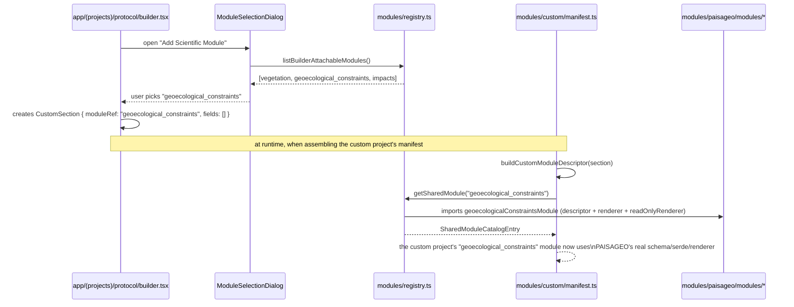

# 06. Kernel and capabilities

## ProtocolRegistry: registration and dependency resolution

`protocol-kernel/registry.ts` (`createProtocolRegistry()`) keeps a `Map<string, ProtocolManifest>` and delegates capability storage to the `CapabilityBus`. Two operations matter:

### `register(manifest)`

1. If `manifest.id` already exists, it records a `duplicate_protocol` error and returns without overwriting.
2. Otherwise, it stores the manifest and registers each capability from `manifest.provides` on the bus (`bus._register(cap)`), checking for duplicates (`duplicate_capability`) by `cap.id`.

### `resolve()`

Three steps, all verified in the code:

1. **Required-capability check**: for each entry in `manifest.requires`, if the capability isn't on the bus and isn't `optional`, it produces a `missing_capability` error. If it's present, it finds who provides it (`findProvider`) and records that dependency.
2. **Graph assembly**: `deps: Map<protocolId, Set<providerId>>` — "who I need to have already loaded before me."
3. **Topological sort (Kahn's algorithm)**: computes `freeInDegree` (how many providers each protocol is still waiting on), processes the queue of zero-degree protocols, decrementing dependents' degree as each provider is "loaded." If any protocol is left out of `loadOrder`, that's a dependency cycle — it becomes an error.

Returns `{ loadOrder, ok, errors }`. Today, with `paisageo.requires = []` and `custom.requires = []` (neither manifest declares any requirement — see the note below), no cycle is possible and `loadOrder` simply reflects the registration order in `modules/bootstrap.ts`.

## CapabilityBus: an in-memory bus

`protocol-kernel/capability-bus.ts` is deliberately simple: a `Map<string, CapabilityDeclaration>` with `_register` (called only by the registry), `get`, `has`, `list`. `get()` wraps the raw `implementation` in a `CapabilityHandle` with `invoke()`:

```typescript
// protocol-kernel/capability-bus.ts:20-27
get<I, O>(id: string, _versionRange?: string): CapabilityHandle<I, O> | null {
  const decl = store.get(id) as CapabilityDeclaration<I, O> | undefined;
  if (!decl) return null;
  return { id: decl.id, version: decl.version, invoke: (input: I) => decl.implementation(input) };
}
```

`_versionRange` is received and ignored — there's no version-range validation in v1 (consistent with an earlier design decision to defer that until there's a real second consumer).

## Historical note: cross-protocol capability via `requires`

An earlier version of this documentation described custom consuming `kuchler.buildFormula` from PAISAGEO via `CapabilityRequirement`/`requires`. That mechanism was removed: the `kuchler.buildFormula` capability and its consumer (a `kuchler-consumer.ts` in both protocols) never had a real consumer outside their own test, so they were deleted. Today `paisageoManifest.requires` and `customManifest.requires` are both `[]` — no protocol consumes another's `requires`. `CapabilityBus`/`requires` still exist in the kernel and work exactly as described above, they just don't have a real *cross-protocol* usage example right now. The real cross-protocol reuse case today is different, described next.

## The real case: Custom attaching an entire PAISAGEO scientific module

Instead of consuming an isolated capability, the custom protocol can reuse an entire PAISAGEO `ModuleDescriptor` — schema, serialize/deserialize, collection renderer, and read-only renderer together — through the `modules/registry.ts` aggregator catalog. This is the one and only file allowed to import `modules/paisageo/` from outside `modules/paisageo/` itself; no file inside `modules/custom/` imports `modules/paisageo/` directly.

```typescript
// modules/registry.ts
export function getSharedModule(moduleId: string): SharedModuleCatalogEntry | undefined { ... }
export function listSharedModules(): SharedModuleCatalogEntry[] { ... }
export function listBuilderAttachableModules(): SharedModuleCatalogEntry[] { ... }
```

Today `listBuilderAttachableModules()` exposes the 3 PAISAGEO modules (`vegetation`, `geoecological_constraints`, `impacts`) to the Personalized protocol builder.



So a section of a Personalized protocol stops being just user-defined fields — it can *be* PAISAGEO's geoecological constraints module, with all its scientific logic (validation, serialization, export, UI) reused without duplication and without a direct import between the two `modules/<protocol>/` folders.

### Static isolation check

The automated guarantee that "protocols don't import each other" still exists, generalized and expanded: `protocol-kernel/__tests__/layer-rules.test.ts` declares the entire layer ordering as a data table ("layer X cannot import from layer Y," with a "types only" exception where applicable), builds the real import graph for all of `mobile-app/` via the TypeScript Compiler API's AST (not substring search), and fails if any production file violates a rule in the table — it covers any pair of protocols present in the repo (discovered dynamically under `modules/`, except `generic/`), and ignores `modules/registry.ts`/`modules/bootstrap.ts` (the authorized aggregators/composition-root).

### `CapabilityBus` in practice today

PAISAGEO still provides two capabilities, but they're no longer used quite the same way:

- **`landscape.generateName`** is genuinely invoked through the bus: `app/(survey)/survey/form.tsx` calls `bus.get<LandscapeGenerateNameInput, string>("landscape.generateName")` and, if present, `.invoke()`s it when saving a point — this avoids importing `modules/paisageo/` directly to run that scientific logic.
- **`kuchler.classifyVegetation`** is still declared as a capability (`modules/paisageo/capabilities/vegetation-classifier.ts`) and registered on the bus, but `app/(projects)/project-details/[id].tsx` only uses `manifest?.provides?.some(c => c.id === "kuchler.classifyVegetation")` — a feature-detection check, not a `bus.get().invoke()` call. The actual classification now happens through a direct function call inside PAISAGEO itself (`modules/paisageo/services/kuchler-formula.ts` calls `classifyVegetation()` from `vegetation_classifier.ts` directly), not through the bus.

So today the bus's one real cross-layer use (UI consuming protocol logic without importing it) is `landscape.generateName`; `kuchler.classifyVegetation`'s bus registration is present but only consulted for presence, not invoked — decoupling the presentation layer from the protocol's implementation remains the bus's purpose, it just isn't exercised by every declared capability the same way. Either way, no protocol consumes another protocol's capability through it, and exchanging data between two different protocols isn't what it's used for.

## If you go to consume a capability that doesn't exist

`bus.get(id)` returns `null` (it doesn't throw) when the capability isn't registered — whether because the providing protocol was never registered, or because `id` is wrong. That's why every consumer must check the return value before calling `.invoke()`, as `tryBuildKuchlerFormula` does. If the requirement is **not** `optional` and the capability is missing, the error shows up in `resolve().errors` as `missing_capability`, and `bootstrapProtocols()` (`modules/bootstrap.ts`) only logs it with `console.error` — it doesn't stop the app from booting.
