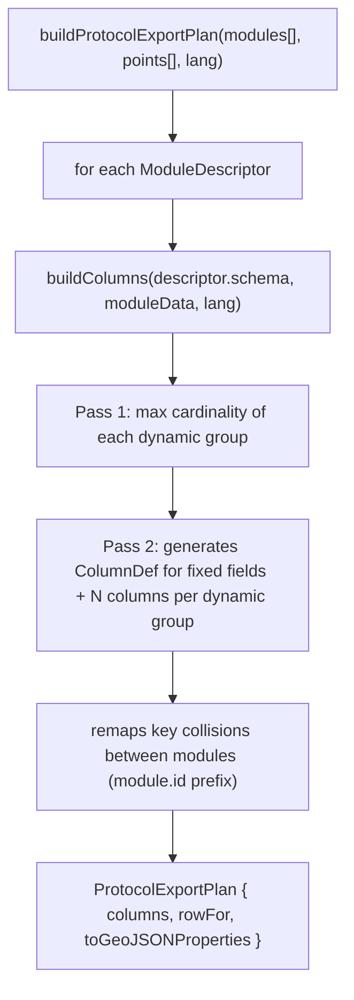

# 07. Export

## Two layers of the export engine

1. **`core/schema/dynamic-columns.ts`** (`buildColumns`): resolves **one module** at a time — takes a `ModuleSchema` and that module's data for every point, and returns a `ColumnPlan` (columns + `rowFor`).
2. **`core/export/generic-export-engine.ts`** (`buildProtocolExportPlan`): composes **multiple modules** of an entire protocol into a single row per point, calling `buildColumns()` for each `ModuleDescriptor` and concatenating the result.



## The two-pass algorithm in `buildColumns`

`core/schema/dynamic-columns.ts`:

**Pass 1 — max cardinality**: for each `DynamicGroupRule` in the schema, it scans every point and keeps the largest `array.length` found at `point[group.groupId]`. E.g.: if point A has 2 soil layers and point B has 3, `maxCounts.get("soil_layers") === 3`.

**Pass 2 — column construction**:
- Fixed fields (`schema.fields`): one column per field, skipping `exportable === false` and media types (`photo`, `audio`).
- Dynamic groups: for `i` from 1 to `maxCounts[groupId]`, generates one column per `itemField`, with key `columnNamePattern.replace("{i}", i).replace("{field}", field.id)`. E.g.: `"soil_layer_2_texture"`.

**`rowFor(pointModuleData)`**: same logic, but extracting values. If a point has fewer items than the computed `max`, the extra columns come out `null` (no error, and other points' columns don't get misaligned).

`toCell()` normalizes each value's type for the cell: `null/undefined → null`; `number` passes through; `boolean → "true"/"false"`; `array → join(", ")`; anything else becomes `String(val)`.

### Verified example (soil layers)

With 3 points, where point 1 has 2 layers and point 2 has 1:

```
maxCounts["soil_layers"] = 2
columns = [
  { key: "soil_layer_1_depth_start", label: "Start depth (cm) 1" },
  { key: "soil_layer_2_depth_start", label: "Start depth (cm) 2" },
  ... (12 other fields × 2 layers = 28 columns total)
]
rowFor(point1) → ["0", "20", ...]        // 2 layers filled in
rowFor(point2) → ["0", null, ...]        // only 1 layer; second comes out null
```

Real PAISAGEO cardinalities: **soil layers** — 14 fields per layer (`soilLayerItemFields`, `modules/paisageo/modules/geoecological-constraints/schema.ts`, inside the merged `geoecological_constraints` module — see note below), `columnNamePattern: "soil_layer_{i}_{field}"` (English column names, aligned with the project's code-naming convention); **vegetation strata** — 5 fields per stratum (`vegetationStrataItemFields`, `.../vegetation/schema.ts`), `columnNamePattern: "veg_stratum_{i}_{field}"`; **impacts** — 3 fields per impact (`impactsItemFields`, `.../impacts/schema.ts`), `columnNamePattern: "impact_{i}_{field}"`.

**Note:** the `geomorphology` and `soil` modules were merged into a single `geoecological_constraints` module. The exported column names (`exposure`, `soil_layer_{i}_{field}`, `litter_layer`, etc.) didn't change — only the originating `module_id`, which now prefixes collisions as `geoecological_constraints_<key>` instead of `soil_<key>`/`geomorphology_<key>`.

## Composing multiple modules: `buildProtocolExportPlan`

`core/export/generic-export-engine.ts`. For a protocol with N modules:

1. Defines the **point-level columns**, in two parts:
   - `BASE_POINT_COLUMNS`: 6 generic columns, universal to any protocol — `id`, `point_number`, `created_at`, `latitude`, `longitude`, `altitude`. These live in the generic engine because they don't assume anything about a specific protocol.
   - `extraPointColumns` (4th parameter, optional, default `[]`): protocol-specific point-level columns, which the protocol itself declares and passes in the call. PAISAGEO passes `EXTRA_POINT_COLUMNS` (`modules/paisageo/services/export-columns.ts`): `generated_name`, `landscape_class_id`, `point_size` — 3 columns that only make sense for it (the name generated by Kuchler classification, landscape-class id, plot size). `customExporter` doesn't pass anything, so exports of the Personalized protocol only get the 6 base columns — a real, intentional asymmetry between PAISAGEO and Custom, not a bug.
   - **Note:** `photo_count` and `additional_notes`, which an earlier version of this documentation listed as fixed tabular columns, no longer exist as CSV/GeoJSON columns — point-level text notes (`additional_notes`) now only turn into `notes.txt` in the media ZIP export (see "Writing and sharing the file" below), and `photo_count` was removed (there's no longer a photo count in any export).
2. For each `ModuleDescriptor`, it extracts each point's module data (`p.modules[descriptor.id]`) and calls `buildColumns()`.
3. **Cross-module key-collision detection**: if two different modules produce a column with the same `key` (this doesn't happen today between geoecological_constraints/vegetation/impacts, but could happen with custom modules), the second occurrence is prefixed with `${descriptor.id}_${col.key}`.
4. `rowFor(point)` concatenates the point values (base + extra) plus every module's values, and passes each cell through `sanitizeCell()`, which replaces line breaks (`\n`, `\r\n`, `\r`) with `" | "` — important so the CSV doesn't break.
5. `toGeoJSONProperties(point)` reuses `rowFor()` and builds a `{ [columnKey]: value }` object to become a GeoJSON `Feature`'s `properties`.

## The PAISAGEO exporter's quirk: species

The generic engine knows nothing about species — they live in the `species` table, not in `point_modules`. `modules/paisageo/services/export.ts` does a **post-plan enrichment**:

```typescript
// services/export.ts (GeoJSON) — the same pattern repeats for CSV
const plan = buildProtocolExportPlan(paisageoManifest.modules, points, language, EXTRA_POINT_COLUMNS);
const props = plan.toGeoJSONProperties(p);
const speciesRow = await fetchSpeciesRow(p.id);         // direct query to db/queries/species.ts
SPECIES_COLUMNS.forEach((col, i) => { props[col] = speciesRow[i] ?? null; });
```

`language` is no longer hardcoded to `"pt"` — `exportGeoJSON`/`exportCSV` receive `language: LanguageCode` as a parameter (`protocol-kernel/types.ts`), propagated from the screen (`app/(projects)/project-details/[id].tsx`, which passes `currentLanguage as LanguageCode` from `useI18n()`) through the `ExporterFactory` to `buildProtocolExportPlan`. The same applies to `modules/custom/services/export.ts`. This affects the CSV/GeoJSON column labels, which now come out in the app's active language at export time, not always in Portuguese.

`fetchSpeciesRow()` looks species up via `getSpeciesByPoint()` and builds 4 columns joined with `"; "`: `veg_species`, `veg_species_scientific`, `veg_species_common`, `veg_species_abundance`. This is PAISAGEO-specific (`customExporter` has no equivalent) and isn't part of the generic engine — it's protocol business logic layered on top of the generic plan.

## Writing and sharing the file

`core/export/file-writer.ts`:

- **`escapeCsv(value)`**: escapes `"` by doubling it (`""`) and wraps the value in quotes if it contains a comma, line break, or quote — RFC 4180 style.
- **`writeAndShare(filename, content, mimeType)`**: writes to `Paths.cache` via `expo-file-system` and opens the native share dialog via `expo-sharing`.
- **`exportMedia(points, extractMediaFn, projectName)`**: assembles a `Point_N/` folder per point with photos, audio notes (filename with an embedded date), and now also **text notes** (`notes.txt` per point, if any), zips everything with `react-native-zip-archive`, and shares the `.zip`. Outside the scope of `buildProtocolExportPlan` — it's called separately by the UI when the user requests "export media." The temporary export directory is created fresh (clearing any leftovers from a previous run), and the whole function body runs inside a `try/finally` that always deletes that directory at the end, even if something throws midway. `extractMediaFn` (the `MediaFiles` from `core/export/types.ts`) also has a third field, `notes: string[]`, alongside `photos`/`audioNotes`.

## Difference between exporting PAISAGEO and exporting Custom

Structurally almost identical — both call `buildProtocolExportPlan()` and then `writeAndShare()`. The differences are where the `ModuleDescriptor[]` comes from, and the extra point columns:

- **PAISAGEO**: `paisageoManifest.modules` (read directly from the manifest, `modules/paisageo/services/export.ts` — there's no separate exporter-owned list anymore, see [11_GUIDE_NEW_MODULE.md](11_GUIDE_NEW_MODULE.md)), plus `EXTRA_POINT_COLUMNS` as the 4th argument (see the previous section).
- **Custom**: resolved at runtime — `resolveCustomModules(protocolId)` (`modules/custom/services/export.ts`) looks up the `CustomProtocolSchema` in the database and calls `buildCustomModuleDescriptor()` for each section — i.e., the export's modules don't even exist as code before the user has designed the form. This holds even for a section with `moduleRef` (which attaches an entire PAISAGEO scientific module via `modules/registry.ts` — see [06_KERNEL_AND_CAPABILITIES.md](06_KERNEL_AND_CAPABILITIES.md)): the resulting `ModuleDescriptor` is still resolved at runtime, not PAISAGEO's static list. Custom never passes `extraPointColumns`.

This is proof that "the generic exporter works automatically for a new protocol" (see [10_GUIDE_NEW_PROTOCOL.md](10_GUIDE_NEW_PROTOCOL.md)): neither custom nor a hypothetical future protocol needs to reimplement the dynamic-column logic, it just needs to supply valid `ModuleDescriptor[]`.
