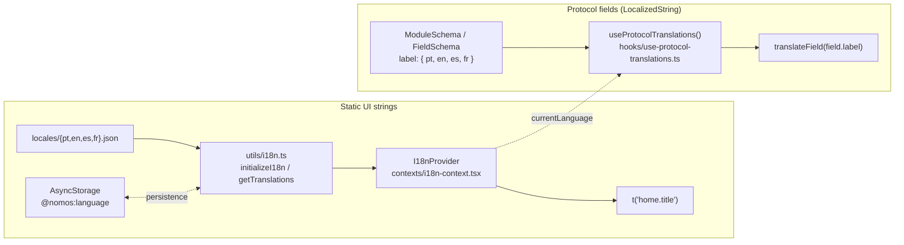

# 08. Internationalization (i18n)

Nomos has **two distinct translation mechanisms that share no code**: one for static UI strings (menus, buttons, screen titles) and another for protocol fields (form labels, module names). Understanding that these are two separate systems saves you from looking for a protocol string inside `locales/*.json` (it isn't there).



## Mechanism 1: static UI strings

- **Where the text lives**: `locales/pt.json`, `en.json`, `es.json`, `fr.json` — global files at the root of `mobile-app/`, organized into nested namespaces (e.g. `common.save`, `home.title`, `tabs.settings`).
- **Loading and persistence**: `utils/i18n.ts` imports the 4 JSON files statically (`import pt from "@/locales/pt.json"`, etc.), keeps `currentLocale` in a module-level variable, and persists the user's choice in `AsyncStorage` under the key `"@nomos:language"` (`initializeI18n`, `changeLanguage`).
- **Access via Context**: `contexts/i18n-context.tsx` (`I18nProvider`) initializes `utils/i18n.ts` on mount, and exposes `currentLanguage`, `setLanguage()`, and the `t(key, options?)` function, which resolves nested keys (`"home.title"` → `translations.home.title`) with simple `{{variable}}` interpolation.
- **Usage**: any component calls `const { t } = useI18n()` and uses `t("common.save")`. Project rule: every string visible to the user goes through `t()`; no hardcoded text in the UI.

## Mechanism 2: protocol fields (`LocalizedString`)

No protocol-module text (field label, module title, select option) comes from a locale file. Instead, each `FieldSchema`/`ModuleDescriptor` carries its own text **embedded in the source code**, as a `LocalizedString = Record<string, string>` object:

```typescript
// modules/paisageo/modules/geoecological-constraints/schema.ts (a real FieldSchema)
{ id: "depth_start", label: { pt: "Prof. inicial (cm)", en: "Start depth (cm)", es: "Prof. inicial (cm)", fr: "Prof. initiale (cm)" }, type: "text" }
```

Resolving this object into a string in the current language is the consumer's responsibility:

- Directly: `field.label[language] ?? field.label["pt"] ?? field.id` — this is how `modules/generic/GenericModuleRenderer.tsx` and `core/schema/dynamic-columns.ts` do it, always falling back to `"pt"`.
- Via a hook: `hooks/use-protocol-translations.ts` (`useProtocolTranslations().translateField`) does the same resolution, but recursively over a legacy protocol structure (`protocol.sections[].fields[].label/options/config...`) coming from the old custom-protocol-builder JSON, including compatibility with older formats (a plain string, or an object with a nested `desc`).

Both paths read `currentLanguage` from `useI18n()` — that's the only point of contact between the two mechanisms.

## Divergence from an earlier design

An earlier design decision called for *"protocol translations centralized in each plugin (`modules/<id>/locales/`); protocol strings removed from the global `locales/*.json`."* That was never implemented. In the current code:

- There is no `modules/paisageo/locales/` (confirmed by searching the directory).
- The `localesRef?: string` field exists on the `ProtocolManifest` type, but no real manifest fills it in usefully — `modules/custom/manifest.ts` even declares `localesRef: ""`, an empty string.
- In practice, PAISAGEO's translations live physically inside the TypeScript source of the schemas (`LocalizedString` per field), not in separately-loadable locale files.

If this project ever wants to extract those translations into external files (making them editable by someone who doesn't touch code), the entry point would be replacing the `{ pt: "...", en: "..." }` literals in each `schema.ts` with a reference resolved from a JSON loaded via `localesRef` — today that mechanism exists only as a type, not as an implementation.

## Supported languages

pt (primary), en, es, fr — consistent across both mechanisms: `locales/*.json` has all 4 files, and every `LocalizedString` in the PAISAGEO schemas fills in all 4 keys.

## Export now respects the active language

`buildProtocolExportPlan()` used to always be called with a fixed `"pt"` in both the PAISAGEO and Custom exporters, so the CSV/GeoJSON column labels always came out in Portuguese, regardless of the UI's selected language. That changed: `ProtocolExporter.exportGeoJSON`/`exportCSV` (`protocol-kernel/types.ts`) now receive `language: LanguageCode` as a parameter, and the export screens pass `currentLanguage` from `useI18n()`. In other words, export now consumes Mechanism 1 (the UI's active language) to decide how to resolve Mechanism 2 (the schemas' `LocalizedString`) — see [07_EXPORT.md](07_EXPORT.md) for the propagation details.
