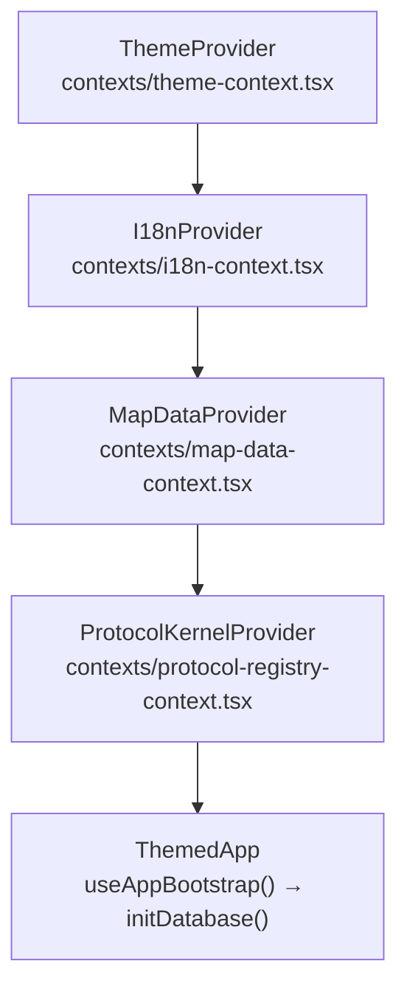
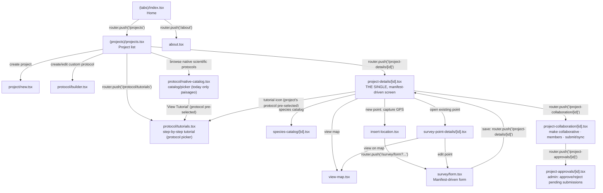
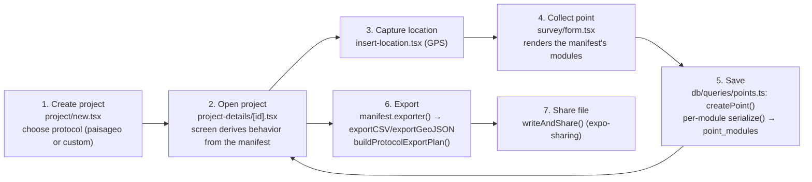

# 09. Screen flow

## Provider stack (`app/_layout.tsx`)

The entire screen tree runs inside this provider stack, mounted once in the root layout:



While `useAppBootstrap()` hasn't finished (`isReady === false`), the screen shows only an `ActivityIndicator` — no real screen renders before the database is ready. Once ready, `ThemedApp` additionally wraps the navigation `Stack` in `PaperProvider` (theme) and `DialogProvider` (`hooks/use-dialog.tsx`, a dialog/modal helper), both nested inside `ThemedApp` itself rather than in the outer stack above.

## Real navigation map (Expo Router)

Compiled from every `router.push`/`router.replace` call found in `app/`:



Verified points (file:line):

- `projects.tsx:266` → `router.push('/project-details/${item.id}')` — **all** project-details navigation goes to `project-details/[id]`. There is now only one details screen; an earlier compatibility shim at `project-details-custom/[id].tsx` (which used to redirect there) has been removed entirely.
- `insert-location.tsx:314-315` builds the form URL, including `protocolId=${resolveManifestId(project)}` and, for custom projects, `customProtocolDbId=${project.protocol_id}` — this is how `survey/form.tsx` knows which manifest and which modules to load.
- `survey-point-details/[id].tsx:410-416` builds the same URL when editing an existing point, branching on `isOfficial` (paisageo) vs. custom.
- `survey/form.tsx:498` navigates back to `project-details/${projectId}` after saving.
- `projects.tsx:522` → `router.push('/protocol/native-catalog')` — a recommendation card in the project list leads to the native scientific protocol catalog (`protocol/native-catalog.tsx`), which reads `NATIVE_PROTOCOLS_CATALOG` (`constants/native-protocols-catalog.ts`) and the `ProtocolRegistry`'s manifest list to show each available native protocol's workflow and modules before the user creates a project with it — today only the `paisageo` entry exists.
- `protocol/tutorials.tsx` is the step-by-step tutorial screen, with the same protocol picker (Dialog) as `native-catalog.tsx`, but listing `registry.listProtocols()` **without** filtering out `kind === "custom"` — the generic `"custom"` manifest (`modules/custom/manifest.ts`) shows up as another option, alongside `paisageo`. It reads `PROTOCOL_TUTORIALS` (`constants/protocol-tutorials.ts`), indexed by the same manifest `id`. It accepts `?protocolId=<id>` in the URL to open with a protocol pre-selected; without the parameter, it falls back to the first manifest in the list (same fallback as `native-catalog.tsx`). Three entry points, all passing `protocolId` except the one from the project list:
  - `projects.tsx` (Protocols tab) → `router.push('/protocol/tutorials')`, with no protocol pre-selected.
  - `protocol/native-catalog.tsx:228` → `router.push('/protocol/tutorials?protocolId=${selected.id}')`, with the catalog's currently-displayed protocol.
  - `project-details/[id].tsx:627` → `router.push('/protocol/tutorials?protocolId=${manifestId}')`, where `manifestId = resolveManifestId(project)` — `"paisageo"` for native projects and always `"custom"` for Personalized-protocol projects, so the same button works for both cases with no conditional logic in the screen.
- `project-details/[id].tsx:893` → `router.push('/project-collaboration/${project.id}')` — the only entry point into the collaboration hub, from a menu action on the details screen.
- `project-collaboration/[id].tsx:585` → `router.push('/project-approvals/${project.id}')` — admin-only button inside the collaboration hub, leading to the pending-submissions queue.

## Google account and joining a collaborative project

Two collaboration entry points are **not** part of the `router.push` graph above, because neither is a dedicated route:

- **Connecting a Google account**: `app/(tabs)/settings.tsx:227-246` — a "Google Account" row in Settings opens `GoogleAccountSettingsModal` (a modal, not a screen), which calls `connect()`/`disconnect()` from `useGoogleAccount()` (`hooks/use-google-account.ts`) to sign in/out. This is a prerequisite for every other collaboration flow, but it's reached from the Settings tab, not from a project screen.
- **Joining an existing collaborative project**: there is no dedicated "join" screen or deep link. `app/(projects)/projects.tsx` has a Drive-folder picker dialog (`driveDialogVisible`) that lists the caller's shared Drive folders (`listAllDriveProjects`) and, on selecting one, `handleDownloadDriveProject` (`projects.tsx:169-184`) calls `joinAndCreateLocalProject(driveFolderId, googleAccount.email)` (`core/drive-sync/project-drive-service.ts`) directly, then `syncProjectFromDrive` to pull the initial data down — all inside that one dialog, without navigating anywhere else.

## End-to-end user flow: create project → collect → export



This is the flow that exercises the architecture end to end: the protocol choice in (1) determines, via `resolveManifestId()`, which `ProtocolManifest` the details screen (2) consults to know which modules to show and which exporter to use; the form (4) uses a `ModuleRendererBinding` or `GenericModuleRenderer` depending on whether the module has a specialized renderer or not (see [01_ARCHITECTURE.md](01_ARCHITECTURE.md) and [13_FAQ.md](13_FAQ.md)); and export (6) uses the same generic engine regardless of which protocol was chosen in (1).

## Specialized vs. generic renderer, inside the form

`app/(survey)/survey/form.tsx` decides, module by module, which component to use:

```typescript
// survey/form.tsx (summarized)
const Renderer = rendererRegistry.get(moduleId) as React.ComponentType<any> | undefined;
if (Renderer) {
  return <Renderer value={value} onChange={onChange} language={lang} onInfoPress={handleInfoPress} {...extraProps} />;
}
return <GenericModuleRenderer module={module} value={value} onChange={onChange} language={lang} ... />;
```

This is what lets PAISAGEO's 3 modules (with rich UI: `KuchlerMatrix`, `SoilProfileInput`, etc.) and the modules generated at runtime by the custom protocol (no registered Renderer, so always `GenericModuleRenderer`) coexist on the same form screen with no `if (protocol === "paisageo")` anywhere.

## Read-only renderer, on the details screen

`survey-point-details/[id].tsx` (the details/edit screen for an already-collected point) doesn't reuse `rendererRegistry` — it consults a separate registry, `readOnlyRendererRegistry` (`useReadOnlyRendererRegistry()`), which resolves `ModuleReadOnlyRendererBinding` instead of `ModuleRendererBinding`. This exists because displaying an already-filled-in module (a read-only card, without the interactive collection components) has different UI needs than collection, and keeping it in a separate registry avoids touching the ~10 interactive-renderer files when adjusting the read-only display. Modules without a registered read-only binding fall back to the generic display (`modules/generic/read-only-display.ts`), the same specialized-with-generic-fallback pattern as the collection form.

## Map overlays (`view-map.tsx`)

`app/(projects)/view-map.tsx` mounts two floating overlays on top of `react-native-maps`, both in `components/map/` (not protocol-specific): `LayerMenu.tsx` (an expandable menu to switch `MapType` — standard/satellite/hybrid/terrain, excluding terrain on iOS) and `MapLegend.tsx` (a legend with layers, route, and point count). They share styles via `map-overlay-styles.ts`.
