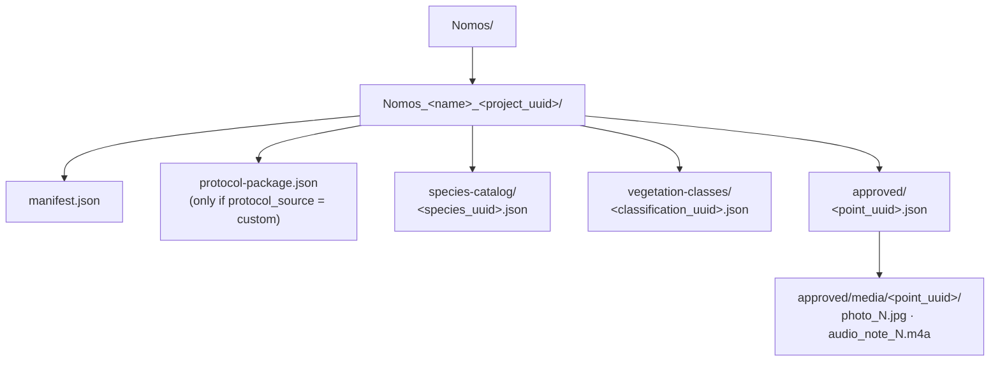

# 12. Backup and collaboration

## Core principle

Exactly one device/account can be the **owner** of a given `project_uuid`
at any time. Ownership is defined by, and only by, having that project
connected to a Google Drive account for backup. Everyone else working on
the same project holds a **collaborator copy** — a fully independent
local project that can never itself become an owner instance of the same
`project_uuid`.

No collaborator ever needs a Google account. Only the owner does, and
only for the backup/restore actions described below.

`projects.collaboration_role` (`'owner' | 'collaborator' | NULL`) is the
single column that decides everything else in this document:

| Value | Meaning |
|---|---|
| `NULL` | A plain local project, never shared in any way. |
| `'owner'` | This device is the authoritative source for this `project_uuid`, connected to a Drive folder (`drive_folder_id`) for backup. |
| `'collaborator'` | This device holds a working copy imported from an owner's configuration package. Can never become `'owner'` for this same `project_uuid` — the UI never offers that transition. |

`db/queries/projects.ts` has exactly two write sites for this column:
`createProject` (sets it once, at row creation — `NULL` by default, or
`'collaborator'` when importing a configuration package) and
`setProjectAsOwner` (the only place that flips it to `'owner'`, called
by both `activateDriveBackup` and `restoreOwnProjectFromDrive` below).

## Schema

See [05_DATA_MODEL.md](05_DATA_MODEL.md) for the full DDL. Summary of
what this feature added:

| Table | New columns |
|---|---|
| `projects` | `collaboration_role`, `owner_email` (set once, when backup is activated — never changes afterward), `drive_folder_id` |
| `points` | `uuid` (stable cross-device identity), `approval_status` (`NULL \| 'pending' \| 'approved' \| 'rejected'` — `NULL` is the normal state for a point that was never part of any import/collaboration flow), `created_by` (collector code, static since export), `drive_synced_at`, `rejection_reason` |
| `custom_protocols`, `project_species_catalog`, `vegetation_classifications` | `uuid` each |

`owner_email` is a **secondary signal only** — `project_uuid` remains the
one real identity check everywhere. `owner_email` exists purely so a
`project_uuid` collision or drift is easier to notice: `updateManifest`
(below) refuses a write that would silently drop it, and importing a
points package warns (never blocks) if the package's `owner_email`
doesn't match the currently connected account.

## The two packages

| | Configuration package | Points package |
|---|---|---|
| Built by | `core/project-sharing/project-config-package.ts` (`buildProjectConfigPackage`) | `core/project-sharing/export-points.ts` (`buildAndSharePointsPackage`) |
| Applied by | same file, `applyProjectConfigPackage` | `core/project-sharing/import-points.ts` (`importPointsPackage`) |
| Format | single `.json` | `.zip` (`points.json` + `media/<point_uuid>/...`) |
| Always produces | a local project with `collaboration_role = 'collaborator'` | new/duplicate points inside an existing local project |
| Carries | `project_uuid`, `protocol_id`/`protocol_source` (+ the custom protocol's schema, if any), the full species catalog, every vegetation classification, `active_vegetation_classification`, `owner_email` | `project_uuid`, `protocol_id`/`protocol_source`, `collector_code`, `owner_email`, one entry per point |

Both carry `format_version: 1` and are rejected outright —
`UnsupportedPackageVersionError`, `core/project-sharing/package-errors.ts`
— if that field is missing or doesn't match, before any other field is
even read.

`ProjectConfigPackage.package_role_for_importer` is always the literal
`"collaborator"`; `applyProjectConfigPackage` validates it explicitly and
refuses anything else, and also refuses to re-apply a package onto a
local project whose `collaboration_role` is already `'owner'` — an owner
instance can never be downgraded by an accidental re-import of its own
exported package.

Every uuid embedded in either package (`project_uuid`, the custom
protocol's, every catalog/classification row's) is generated exactly
once, by the single shared helper `core/utils/uuid.ts` (`generateUuid`,
wrapping `expo-crypto`), and never regenerated once set — every
`ensure*Uuid` query function (`ensureProjectUuid`, `ensurePointUuid`,
`ensureCustomProtocolUuid`, `ensureProjectSpeciesUuid`,
`ensureVegetationClassificationUuid`) reads the current value first and
only calls `generateUuid()` if it's still `NULL`. Re-exporting the same
project twice yields byte-identical identity fields both times.

## Collaborator-side actions

A collaborator collects points locally exactly like any other project —
no Google account involved anywhere in this role. Two export actions,
both in `core/project-sharing/export-points.ts`:

- `exportPointsPackage(pointIds)` — a single point ("send to project
  owner").
- `exportAllPointsPackage(projectId)` — every point in the local
  project, same `.zip` shape.

Both require a local **collector code**: exactly 4 characters, no
uniqueness check against other collaborators (there's no shared registry
of codes in this model — see [Known limitations](#known-limitations)).
`core/local-identity/collector-code.ts` enforces the length;
`components/local-identity/CollectorCodeModal.tsx` is the single shared
modal for setting it, with one home base in Settings
(`app/(tabs)/settings.tsx`) and two trigger points that open it in place
when an export is attempted without a code yet
(`app/(projects)/project-details/[id].tsx`,
`app/(survey)/survey-point-details/[id].tsx`) — the export resumes
automatically once the code is saved. The code is copied onto each point
as a static `created_by` value at export time; changing it afterward
never rewrites points already exported.

## Owner-side: importing points and resolving duplicates

`importPointsPackage` (`core/project-sharing/import-points.ts`)
validates `project_uuid` and protocol first — either mismatch rejects
the **entire** package, nothing is inserted
(`ProjectMismatchError`). For every point that passes, it checks
`getPointByProjectAndUuid` (`db/queries/points.ts`) — deliberately
**not filtered by `approval_status`**, so a point that's already
`pending`, `approved`, or `rejected` all count as "already here":

- **Not a duplicate:** inserted as `approval_status = 'pending'`.
- **Duplicate:** never auto-inserted. Collected and handed to
  `components/project-sharing/PointDuplicatesModal.tsx` after the import
  finishes, one row per duplicate, with **Substituir** (overwrite the
  local point's data, reset it to `'pending'` for re-review) or
  **Descartar** (keep the local point exactly as it is).

Media extracted from the `.zip` is copied into
`Paths.document/imported_points_media/<point_uuid>/` **before** any
database write references it — never a path inside the temporary
extraction directory, which is deleted once import finishes
(`copyMediaToPersistentDir`).

## Local approval queue and rejected points

Two screens, both pure local SQL — no Drive read of any kind:

- `app/(projects)/project-pending-approvals/[id].tsx` — lists
  `approval_status = 'pending'`. **Approve** sets `'approved'` (nothing
  else happens automatically — approval and backup are fully decoupled).
  **Reject** sets `'rejected'` with an optional reason; the point is not
  deleted.
- `app/(projects)/project-rejected/[id].tsx` — lists
  `approval_status = 'rejected'`, with a permanent-delete action
  (`core/points/delete-point-media.ts`, which also removes the point's
  media files from disk). Rejected points are never auto-purged.

## Backup to Drive

Available only when `collaboration_role = 'owner'` and a Google account
is connected. Two steps:

**1. Activation** — `activateDriveBackup(projectId)`
(`core/drive-sync/project-drive-service.ts`). Refuses a project whose
`collaboration_role` is already set to anything
(`InvalidCollaborationRoleError`) and a missing account
(`GoogleAccountRequiredError`). Reuses `buildProjectConfigPackage` (same
uuid-guaranteeing logic as the collaborator package) to build the
initial state, then creates the whole Drive folder tree in one pass and
finally calls `setProjectAsOwner`.

**2. Ongoing backup of approved points** — `backupPoint`/
`backupAllPendingPoints` (`core/drive-sync/backup-service.ts`), driven
by `drive_synced_at IS NULL`. The point's own data (module fields) is
**all-or-nothing**: a failed upload fails the whole point and
`drive_synced_at` stays `NULL`. Media (photos/audio) is **best-effort**
— a failed photo never blocks the point's scientific data from counting
as backed up, only shows up in the result's `mediaFailures`. Every write
in this file is read-before-write (`findChildByName` first): re-backing
up an already-synced point calls `updateJsonFile`/`updateBinaryFile`
against the existing Drive file instead of creating a duplicate — this
is what the app-level UI also enforces by disabling the per-point backup
action once `drive_synced_at` is set
(`project-details/[id].tsx`).

## Drive folder structure

`manifest.json` (`ProjectManifest`, `project-drive-service.ts`) holds
`format_version`, `project_uuid`, `project_name`, `protocol_id`,
`protocol_source`, `owner_email`, and `active_vegetation_classification`
(`{ type: 'standard' }` or `{ type: 'custom', custom_classification_uuid }`).
It is never reconstructed from local state — every writer goes through
`updateManifest(driveFolderId, updater)`, which reads the current file,
applies the updater, and refuses to write (throws, nothing is sent) if
the result would change `project_uuid`, drop a non-null `owner_email`,
or change `format_version`. This read-modify-write discipline is what
keeps two independent writers (activation, and the catalog sync below)
from ever clobbering each other's fields.

## Keeping the catalog in sync after activation

`activateDriveBackup` only uploads the species catalog and vegetation
classifications **once**, at activation time. Anything added or changed
afterward needs its own push, handled by
`core/drive-sync/catalog-sync-service.ts` — a best-effort, additive-only
sweep (never overwrites an existing Drive file, never throws, no-ops
silently for a non-owner project) with three entry points:
`syncSpeciesCatalogToDrive`, `syncVegetationClassesToDrive`, and
`syncActiveVegetationClassificationToDrive`. The last one confirms the
target classification's own file actually exists on Drive
(`findChildByName`, uploading it on the spot if the local row is still
available) **before** pointing the manifest at it — closing a gap where
an independent, earlier best-effort push could have silently failed,
leaving the manifest referencing a uuid with nothing behind it.

This module is wired into **10** real call sites, not the 7 originally
estimated while planning the feature — worth stating explicitly since an
earlier count undershot it:

| File | Call sites |
|---|---|
| `components/species/SpeciesManagementModal.tsx` | 6 — manual add, catalog-file import, GBIF single/bulk, SpeciesLink single/bulk |
| `components/survey/SpeciesInput.tsx` | 1 — a species typed directly on a point also joins the project catalog |
| `modules/paisageo/components/VegetationClassesModal.tsx` | 1 — a brand-new custom classification |
| `app/(projects)/project-details/[id].tsx` | 1 — the "Standard" classification chip |
| `modules/paisageo/components/VegetationClassificationPicker.tsx` | 1 — selecting an existing custom classification as active |

## Restoring the owner's own project on another device

The only remaining scenario where the app reads from Drive proactively,
framed as "your own backup," never as "shared projects." In "Meu
Nomos" (`app/(projects)/projects.tsx`), "Restaurar Meus Projetos do
Drive" lists the signed-in account's own Nomos folders
(`listOwnNomosProjectFolders`,
`core/drive-sync/project-drive-service.ts`) that don't already have a
local project linked (`getUsedDriveFolderIds`), via
`components/drive-sync/RestoreProjectsModal.tsx`.

`restoreOwnProjectFromDrive(driveFolderId, { includeMedia })`
(`core/drive-sync/restore-service.ts`) rebuilds the project entirely
from what's on Drive — no dependency on any local leftover — recreating
it with `collaboration_role = 'owner'`, every species/classification
with its uuid preserved verbatim (never regenerated), and every point
under `approved/` with `approval_status = 'approved'` fixed (pending and
rejected points are never uploaded in the first place, so there's
nothing else to pull). "Somente dados" skips media download for speed;
"Dados e mídia" downloads photos/audio into
`Paths.document/imported_points_media/<point_uuid>/` — the same
persistent directory convention `import-points.ts` already uses, never
a temporary one. A defensive `Set` of seen `point_uuid`s also protects
against a stray duplicate file in `approved/` producing two local rows
for the same point (`points` has a partial unique index on
`(project_id, uuid)` — see [05_DATA_MODEL.md](05_DATA_MODEL.md) — that
would otherwise reject the second insert outright).

`RestoreResult`'s fields, each surfaced to the user in
`projects.tsx`'s `handleProjectRestored`:

| Field | Meaning |
|---|---|
| `imported` | Points actually created locally. |
| `mediaDownloaded` / `mediaFailed` | Per-item counts, never fatal. |
| `ownerEmailWarning` | The manifest's `owner_email` differs from the connected account — informational only, never blocks. |
| `activeClassificationWarning` | The manifest pointed at a custom classification whose file wasn't found among the downloaded ones — the project was restored as `'standard'` instead, and the owner is told to double-check, rather than this happening silently. |
| `duplicatesSkipped` | Stray duplicate point files found and ignored during this restore. |

## Google account and shared modals

Required **only** for the three owner actions above (activate backup,
back up, restore) — never for viewing a collaborator project, exporting
points, reviewing the local approval queue, or the rejected-points area.
No screen gates itself entirely behind a connected account; each
owner-only handler checks individually.

`components/google-account/GoogleConnectionModal.tsx` is the single
shared connection UI, home base in Settings, also opened in place by
`projects.tsx` and `project-details/[id].tsx` whenever one of those
three actions is attempted without a connected account — the pending
action (`pendingDriveIntent`, local state in each screen) resumes
automatically once the modal's `onConnected` fires.
`core/google-auth/google-auth-service.ts` wraps
`@react-native-google-signin/google-signin` behind a lazy `require()`
(never a static top-level import) so the module doesn't crash an
environment without the native binding (Expo Go); `getCurrentGoogleAccount()`
never throws, since Settings calls it eagerly on mount.

## Known limitations

- **No real-device validation.** The EAS build quota is exhausted until
  October — every behavior described in this document is proven only by
  the automated suites in `core/drive-sync/__tests__/` and
  `core/project-sharing/__tests__/`, including explicit red/green proofs
  for the failure scenarios (duplicate Drive uploads, silent
  `'standard'` fallback, manifest field loss). Treat this document as
  accurate to the code, not as confirmation the flows work end to end on
  a physical device.
- **No collector-code uniqueness check.** Two collaborators can pick the
  same 4 characters — there is no shared registry to check against in
  this single-owner model, and none is planned; it only matters as a
  display label alongside a point's own (unique) id.
- **Catalog sync is additive only.** `catalog-sync-service.ts` never
  updates or deletes a Drive file for a species/classification that
  already exists there — editing a classification's content or removing
  a species locally after it was pushed never propagates.
- **No edit history.** "Substituir" on a duplicate point overwrites the
  local row in place; there is no audit trail of who changed what or
  when, beyond `drive_synced_at` and `updated_at`.
- **Single owner, no conflict resolution beyond structural guards.**
  Only one device can hold `collaboration_role = 'owner'` for a given
  `project_uuid` by construction (`InvalidCollaborationRoleError`, the
  partial unique index on `points`, and `updateManifest`'s refusal to
  drop identity fields) — there is no merge/conflict-resolution flow for
  the (unsupported) case of two devices both believing they own the same
  project.
- **Generic restore errors carry a raw technical detail.** Any Drive/network
  error outside the handful of specifically mapped cases
  (`core/drive-sync/restore-error-messages.ts`) is shown to the user
  with the original technical message appended to a friendly sentence,
  rather than a fully localized explanation — acceptable for diagnosis
  during this pre-device-testing phase, not final UX polish.
