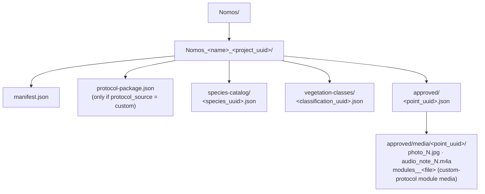

# 12. Backup and collaboration

## Core principle

Exactly one device/account can be the **owner** of a given `project_uuid`
at any time. Ownership is defined by, and only by, having that project
connected to a Google Drive account for backup. Everyone else working on
the same project holds a **collaborator copy** — a fully independent
local project that can never itself become an owner instance of the same
`project_uuid`.

No collaborator ever needs a Google account. Only the owner does, and
only for the backup/restore actions described below.

`projects.collaboration_role` (`'owner' | 'collaborator' | NULL`) is the
single column that decides everything else in this document:

| Value | Meaning |
|---|---|
| `NULL` | A plain local project, never shared in any way. |
| `'owner'` | This device is the authoritative source for this `project_uuid`, connected to a Drive folder (`drive_folder_id`) for backup. |
| `'collaborator'` | This device holds a working copy imported from an owner's configuration package. Can never become `'owner'` for this same `project_uuid` — the UI never offers that transition. |

`db/queries/projects.ts` has exactly two write sites for this column:
`createProject` (sets it once, at row creation — `NULL` by default, or
`'collaborator'` when importing a configuration package) and
`setProjectAsOwner` (the only place that flips it to `'owner'`, called
by both `activateDriveBackup` and `restoreOwnProjectFromDrive` below).

## Schema

See [05_DATA_MODEL.md](05_DATA_MODEL.md) for the full DDL. Summary of
what this feature added:

| Table | New columns |
|---|---|
| `projects` | `collaboration_role`, `owner_email` (set once, when backup is activated — never changes afterward), `drive_folder_id` |
| `points` | `uuid` (stable cross-device identity), `approval_status` (`NULL \| 'pending' \| 'approved' \| 'rejected'` — `NULL` is the normal state for a point that was never part of any import/collaboration flow), `created_by` (collector code, static since export), `drive_synced_at`, `rejection_reason` |
| `custom_protocols`, `project_species_catalog`, `vegetation_classifications` | `uuid` each |

`owner_email` is a **secondary signal only** — `project_uuid` remains the
one real identity check everywhere. `owner_email` exists purely so a
`project_uuid` collision or drift is easier to notice: `updateManifest`
(below) refuses a write that would silently drop it, and importing a
points package warns (never blocks) if the package's `owner_email`
doesn't match the currently connected account.

## The two packages

| | Configuration package | Points package |
|---|---|---|
| Built by | `core/project-sharing/project-config-package.ts` (`buildProjectConfigPackage`) | `core/project-sharing/export-points.ts` (`buildAndSharePointsPackage`) |
| Applied by | same file, `applyProjectConfigPackage` | `core/project-sharing/import-points.ts` (`importPointsPackage`) |
| Format | single `.json` | `.zip` (`points.json` + `media/<point_uuid>/...`, plus `media/<point_uuid>/modules/...` for custom-protocol module media) |
| Always produces | a local project with `collaboration_role = 'collaborator'` | new/duplicate points inside an existing local project |
| Carries | `project_uuid`, `protocol_id`/`protocol_source` (+ the custom protocol's schema, if any), the full species catalog, every vegetation classification, `active_vegetation_classification`, `owner_email` | `project_uuid`, `protocol_id`/`protocol_source`, `collector_code`, `owner_email`, one entry per point |

**Media in the points package.** Photos and audio notes of a point travel
in two places, because they live in two places locally:

- Point-level media (`points.photos` / `points.audio_notes`) goes to
  `media/<point_uuid>/photo_N.<ext>` and `audio_note_N.<ext>`;
  `points.json` lists only the file names.
- Custom-protocol media (`photo_input` / `audio_notes_input` fields, which
  are stored inside each module's `data_json`) goes to
  `media/<point_uuid>/modules/<file>`, and every URI in the exported
  `data_json` is replaced by a `package-media:modules/<file>` marker, so no
  device path ever leaves the sender. This covers both top-level fields
  (`<moduleId>_<n>.<ext>`) and the media sub-fields of every item of a
  `repeatable_group` (`<moduleId>_<groupId>_<itemIndex>_<fieldKey>_<n>.<ext>`;
  `<n>` is a running counter per point, so names never collide). A group
  value is a JSON array of item objects under the group id, and a media
  sub-field of an item holds JSON text exactly like a top-level one; the
  item itself is never removed, only its media references are rewritten.
  Groups are walked one level deep (the builder does not allow a group
  inside a group). The field list comes from the custom protocol's schema
  (`getModuleMediaFields`) and the traversal from `mapModuleMediaUris` /
  `listModuleMediaUris`, both in `core/project-sharing/module-media.ts` and
  shared by every consumer below; shared-module sections (`moduleRef`)
  carry no such fields.

Both carry `format_version: 1` and are rejected outright —
`UnsupportedPackageVersionError`, `core/project-sharing/package-errors.ts`
— if that field is missing or doesn't match, before any other field is
even read.

`ProjectConfigPackage.package_role_for_importer` is always the literal
`"collaborator"`; `applyProjectConfigPackage` validates it explicitly and
refuses anything else, and also refuses to re-apply a package onto a
local project whose `collaboration_role` is already `'owner'` — an owner
instance can never be downgraded by an accidental re-import of its own
exported package.

Every uuid embedded in either package (`project_uuid`, the custom
protocol's, every catalog/classification row's) is generated exactly
once, by the single shared helper `core/utils/uuid.ts` (`generateUuid`,
wrapping `expo-crypto`), and never regenerated once set — every
`ensure*Uuid` query function (`ensureProjectUuid`, `ensurePointUuid`,
`ensureCustomProtocolUuid`, `ensureProjectSpeciesUuid`,
`ensureVegetationClassificationUuid`) reads the current value first and
only calls `generateUuid()` if it's still `NULL`. Re-exporting the same
project twice yields byte-identical identity fields both times.

## Role-based actions

Which collaboration action a project shows is decided by
`projects.collaboration_role` alone, never by whether a Google account
happens to be connected. The table lives in one place,
`getProjectActionVisibility(role)`
(`core/project-sharing/action-visibility.ts`), and every screen derives
its buttons and cards from it:

| Action | `NULL` (not shared) | `'collaborator'` | `'owner'` |
|---|---|---|---|
| Collect points | yes | yes | yes |
| Export configuration package | yes | **no** | yes |
| Turn into owner / activate Drive backup | yes | **no** | n/a |
| Export point(s) to the owner | no | yes | no |
| Collector code | n/a | yes | n/a |
| Back up to Drive | no | no | yes |
| Pending approvals | no | no | yes |
| Rejected points | no | no | yes |
| Import points package | no | no | yes |

`undefined` is treated like `NULL`. Importing a points package is not a
row of the original design table; it is the owner-side half of the points
flow, so it follows the owner column.

The consumers are `app/(projects)/project-details/[id].tsx` (FAB actions
and the approval/rejected cards), `app/(survey)/survey-point-details/[id].tsx`
("send to owner"), and the two owner-only screens
(`project-pending-approvals/[id].tsx`, `project-rejected/[id].tsx`), which
also load the project and navigate back if the role is not `'owner'`, so a
collaborator copy cannot reach them by route either. The suite
`core/project-sharing/__tests__/action-visibility.test.ts` checks the
table for all three roles side by side. It tests the function the screens
consume, not a rendered screen tree.

**Collection and collector code are not part of the helper.** Collecting
points is always available, and the collector-code entry in Settings is
global to the device (it is the home base, section "Collaborator-side
actions"), so `getProjectActionVisibility` has no flag for either. The
"Collect points" and "Collector code" rows above are the original design
table, not something the helper enforces.

**The services enforce the role too, not only the screens.** Besides the
checks that already lived in the backup (`backup-service.ts`), the
activation (`project-drive-service.ts`), the catalog sync
(`catalog-sync-service.ts`) and re-applying a configuration package
(`project-config-package.ts`), the remaining entry points now refuse a
wrong role themselves, with a typed `ProjectRoleNotAllowedError` (carries
the `action` and the `role`) thrown by `assertProjectActionAllowed`. That
guard reads the same `getProjectActionVisibility` table, so there is no
second copy of the rules:

| Service | Table row | Allowed roles |
|---|---|---|
| `exportProjectConfigPackage` | `exportConfigPackage` | `NULL`, `'owner'` (not `'collaborator'`) |
| `exportPointsPackage` / `exportAllPointsPackage` | `exportPointsToOwner` | `'collaborator'` only |
| `importPointsPackage` | `importPoints` | `'owner'` only |
| `discardMissingMedia` | `backup` | `'owner'` only |

Each check runs before any side effect: before the file picker opens,
before the collector-code prompt and before anything is written or shared.
The screens still hide these actions, so the error only fires if something
calls a service it should not.

**General app features outside the role model.** Exporting a custom
protocol as a JSON file ("Meu Nomos", `app/(projects)/projects.tsx`) and
exporting the species catalog (`components/species/SpeciesManagementModal.tsx`)
are general features of the app, not collaboration actions, so no role
applies to them. Neither file carries a project's identity: the protocol
file holds only the name, theme, description, collection instructions and
schema, and the catalog file only the species list and the export date — no
`project_uuid`, no `owner_email`.

## Collaborator-side actions

A collaborator collects points locally exactly like any other project —
no Google account involved anywhere in this role. Two export actions,
both in `core/project-sharing/export-points.ts`:

- `exportPointsPackage(pointIds)` — a single point ("send to project
  owner").
- `exportAllPointsPackage(projectId)` — every point in the local
  project, same `.zip` shape.

Both resolve to an `ExportPointsReport` (`{ skippedMedia: string[] }`):
a photo or audio file whose source no longer exists on the device is left
out of the zip **and** out of `points.json`, never aborts the export, and
is reported so the screens can warn how many files were left out. Unlike
the Drive backup below, the zip export does not block on missing media.

Both require a local **collector code**: exactly 4 characters, no
uniqueness check against other collaborators (there's no shared registry
of codes in this model — see [Known limitations](#known-limitations)).
`core/local-identity/collector-code.ts` enforces the length;
`components/local-identity/CollectorCodeModal.tsx` is the single shared
modal for setting it, with one home base in Settings
(`app/(tabs)/settings.tsx`) and two trigger points that open it in place
when an export is attempted without a code yet
(`app/(projects)/project-details/[id].tsx`,
`app/(survey)/survey-point-details/[id].tsx`) — the export resumes
automatically once the code is saved. The code is copied onto each point
as a static `created_by` value at export time; changing it afterward
never rewrites points already exported.

## Owner-side: importing points and resolving duplicates

`importPointsPackage` (`core/project-sharing/import-points.ts`)
validates `project_uuid` and protocol first — either mismatch rejects
the **entire** package, nothing is inserted
(`ProjectMismatchError`). For every point that passes, it checks
`getPointByProjectAndUuid` (`db/queries/points.ts`) — deliberately
**not filtered by `approval_status`**, so a point that's already
`pending`, `approved`, or `rejected` all count as "already here":

- **Not a duplicate:** inserted as `approval_status = 'pending'`.
- **Duplicate:** never auto-inserted. Collected and handed to
  `components/project-sharing/PointDuplicatesModal.tsx` after the import
  finishes, one row per duplicate, with **Substituir** (overwrite the
  local point's data, reset it to `'pending'` for re-review) or
  **Descartar** (keep the local point exactly as it is).

Media extracted from the `.zip` is copied into
`Paths.document/imported_points_media/<point_uuid>/` (module media into its
`modules/` subdirectory) **before** any database write references it —
never a path inside the temporary extraction directory, which is deleted
once import finishes (`copyMediaToPersistentDir`). The `package-media:`
markers inside module data are then rewritten to those persisted URIs
(`restoreModuleMedia`), both for new points and for "Substituir" on a
duplicate (`resolvePointDuplicate`).

The importer does not trust the names in `points.json`: it only keeps
photo/audio entries whose file really arrived, and counts the rest in
`ImportPointsResult.missingMedia` instead of saving a path that points
nowhere; the screen warns when that count is not zero.

After an import finishes (and after each duplicate is resolved) the
screen refreshes immediately instead of waiting for a navigation:
`refreshAfterImport` (`core/project-sharing/refresh-after-import.ts`)
clears the cached map data and awaits the reload of the project's list
and counters. The same helper runs after importing a configuration
package in `projects.tsx`. Approving or rejecting a point also clears the
map cache, since it changes what the general list shows.

## Local approval queue and rejected points

Two screens, both pure local SQL — no Drive read of any kind:

- `app/(projects)/project-pending-approvals/[id].tsx` — lists
  `approval_status = 'pending'`. **Approve** sets `'approved'` (nothing
  else happens automatically — approval and backup are fully decoupled).
  **Reject** sets `'rejected'` with a **required** reason
  (`components/project-sharing/RejectPointDialog.tsx`, shared with the
  details screen); the point is not deleted. Tapping a card opens the
  point's details (next section) so the owner can look before deciding.
  `updatePointApprovalStatus` returns `false` on a database failure
  (`updatePoint` swallows errors); both screens treat that as a failed
  decision, not a success.
- `app/(projects)/project-rejected/[id].tsx` — lists
  `approval_status = 'rejected'`; tapping a card opens the point's details
  read-only. It has a permanent-delete action
  (`core/points/delete-point-media.ts`). Deleting a point — here and from
  the regular point screen — removes every media file it references:
  the photo/audio columns and the module media of custom protocols,
  top-level and inside `repeatable_group` items. Only files inside the
  app's own storage (`Paths.document` / `Paths.cache`, no `..` segments)
  are deleted; a reference to anything else (a `content://` uri, a gallery
  picture) is left alone. Rejected points are never auto-purged.

### Reviewing a point before approving or rejecting it

`app/(survey)/survey-point-details/[id].tsx` is the same screen used for
any point; its behavior comes from
`getPointDetailsMode(approval_status, role)`
(`core/project-sharing/point-details-mode.ts`), deduced from the point
itself and the project role — never from a route param, so every way of
reaching the screen behaves the same:

| Mode | When | What the screen offers |
|---|---|---|
| `review` | owner opens a `'pending'` point | Read-only data, a hint card, and a FAB with only **Approve** and **Reject**. Edit, edit location, delete, send-to-owner and the "view on map" button are hidden. |
| `readonly` | owner opens a `'rejected'` point | Read-only data and the stored rejection reason. No FAB at all. |
| `normal` | everything else, including any non-owner | The regular actions (edit, edit location, delete, send-to-owner for collaborators). |

Only the owner can ever get `review`/`readonly` (it reuses
`getProjectActionVisibility(role).pendingApprovals`); pending and rejected
points exist only on the owner's device anyway. The map button is hidden
because the map only lists visible points, so it could not show them.

The screen loads the point with `getPoint` (`SELECT * FROM points WHERE
id = ?`), which deliberately does **not** apply `VISIBLE_POINT_CONDITION`
(below); a regression test in `db/queries/__tests__/points-approval.test.ts`
guards that. After approving or rejecting, the screen clears the map cache
(`clearMapData(project.id)`, same as the queue) and goes back; the queue
reloads on focus. If saving the rejection fails, the reject dialog is
closed first and the error alert shown after it (see "Dialogs inside
Portals and Modals").

**Visibility rule.** The project's general point list, map, CSV/GeoJSON/
media exports and landscape-class numbering only ever contain points whose
`approval_status` is `NULL` (collected directly) or `'approved'`. A
`'pending'` point lives only in the approval queue and a `'rejected'` one
only in the rejected area. The condition is the shared constant
`VISIBLE_POINT_CONDITION` in `db/queries/points.ts`, applied by
`getPointsByProject`, `getPointsWithModulesByProject`,
`classifyProjectPoints` and `countPointsByProject`. Three things are
deliberately **not** filtered: the points-package export
(`getPointsWithRawModulesByProject` exports every status), duplicate
detection (`getPointByProjectAndUuid`, section above) and the
`point_number` bookkeeping in `createPoint`/`deletePoint`, which must see
every row to keep numbers unique. As a consequence, pending points consume
numbers, so the visible list can show gaps until they are approved.

## Backup to Drive

Available only when `collaboration_role = 'owner'` and a Google account
is connected. Two steps:

**1. Activation** — before it runs, `project-details/[id].tsx` asks for
confirmation: *"This project will be linked to the account <email> and
this cannot be changed later."* with **Cancel**, **Use another account**
and **Continue**. The reason is that `owner_email` is written once (into
the manifest and `projects.owner_email`) and never changes
(`updateManifest` refuses to rewrite it), so the person must see which
account the project is binding to. **Use another account** signs the
current account out and reopens the connection modal with the account
chooser forced (see "Google account and shared modals"); once the new
account connects, the confirmation is shown again with the new email.
Only **Continue** starts `activateDriveBackup(projectId)`
(`core/drive-sync/project-drive-service.ts`). Refuses a project whose
`collaboration_role` is already set to anything
(`InvalidCollaborationRoleError`) and a missing account
(`GoogleAccountRequiredError`). Reuses `buildProjectConfigPackage` (same
uuid-guaranteeing logic as the collaborator package) to build the
initial state, then creates the whole Drive folder tree in one pass and
finally calls `setProjectAsOwner`.

**2. Ongoing backup of approved points** — `backupPoint`/
`backupAllPendingPoints` (`core/drive-sync/backup-service.ts`), driven
by `drive_synced_at IS NULL`. `backupAllPendingPoints(projectId,
onProgress?)` calls `onProgress({ current, total })` (1-based, fixed
`total`) before each point; the screen shows "Uploading point N of M".
A failure in one point never stops the batch: besides the failures
`backupPoint` returns, an **unexpected exception** thrown while backing up
a point (a database error, say) is now caught and recorded as that point's
entry in `BackupSummary.failed`, and the loop continues — previously it
aborted the whole batch and lost the report of the points already done.
Media is part of the collection, so a point is **all-or-nothing**:

- The point's data and **all** of its media must reach Drive: point-level
  photos and audio (`photo_N.<ext>`, `audio_note_N.<ext>`) and, for custom
  protocols, the `photo_input` / `audio_notes_input` files that live inside
  module data, including those inside `repeatable_group` items. Module
  files are stored flat in the point's media folder as `modules__<file>`
  (same names as in the points package), and the uploaded JSON references
  them with `package-media:modules/<file>` markers — never a device path.
- If any file is missing locally or fails to upload, the whole point
  fails: its JSON on Drive is **not** written (an existing Drive JSON is
  never rewritten with fewer media than the point has), and
  `drive_synced_at` stays `NULL`. All failures are collected and returned
  together in `BackupResult.error`.
- Every write is read-before-write (`findChildByName` first): re-backing
  up an already-synced point calls `updateJsonFile`/`updateBinaryFile`
  against the existing Drive file instead of creating a duplicate — this
  is what the app-level UI also enforces by disabling the per-point backup
  action once `drive_synced_at` is set (`project-details/[id].tsx`).

### Discarding media that no longer exists on the device

A photo or audio file can disappear from the device (the OS cleared the
cache, the person deleted it). Because backup is all-or-nothing, that
point would otherwise never be backed up. `BackupResult.missingMediaCount`
counts the failed items that are simply gone from the device (as opposed
to upload failures such as no connection, which are not counted), and each
`BackupSummary.failed[]` entry carries `pointId` and `missingMediaCount`.

When that count is above zero, `project-details/[id].tsx` offers
**"Descartar mídias não encontradas"** — after the "back up all" summary,
or after a single-point backup fails:

1. A destructive confirmation states how many files from how many points
   no longer exist and that only the references will be removed.
2. On confirm, `discardMissingMedia(pointId)`
   (`core/points/discard-missing-media.ts`) runs for each affected point.
   It removes the entries whose file does not exist from `points.photos`,
   `points.audio_notes` and, for custom protocols, from the media fields
   inside module data, group items included (keeping each entry's shape
   and the module's `schema_version`; a group item whose media was
   discarded stays, only the reference goes away).
3. The backup is retried, now carrying only the media that exists.

It only ever removes references: files that exist are never touched, a
point with nothing missing is not written at all, and `drive_synced_at` is
left alone (the retried backup sets it). The action cannot be undone.

## Drive folder structure

```mermaid
graph TD
    Root["Nomos/"] --> Proj["Nomos_&lt;name&gt;_&lt;project_uuid&gt;/"]
    Proj --> Manifest["manifest.json"]
    Proj --> Protocol["protocol-package.json<br/>(only if protocol_source = custom)"]
    Proj --> SpeciesCat["species-catalog/<br/>&lt;species_uuid&gt;.json"]
    Proj --> VegClasses["vegetation-classes/<br/>&lt;classification_uuid&gt;.json"]
    Proj --> Approved["approved/<br/>&lt;point_uuid&gt;.json"]
    Approved --> Media["approved/media/&lt;point_uuid&gt;/<br/>photo_N.jpg · audio_note_N.m4a<br/>modules__&lt;file&gt; (custom-protocol module media)"]
```

`manifest.json` (`ProjectManifest`, `project-drive-service.ts`) holds
`format_version`, `project_uuid`, `project_name`, `protocol_id`,
`protocol_source`, `owner_email`, and `active_vegetation_classification`
(`{ type: 'standard' }` or `{ type: 'custom', custom_classification_uuid }`).
It is never reconstructed from local state — every writer goes through
`updateManifest(driveFolderId, updater)`, which reads the current file,
applies the updater, and refuses to write (throws, nothing is sent) if
the result would change `project_uuid`, drop a non-null `owner_email`,
or change `format_version`. This read-modify-write discipline is what
keeps two independent writers (activation, and the catalog sync below)
from ever clobbering each other's fields.

## Keeping the catalog in sync after activation

`activateDriveBackup` only uploads the species catalog and vegetation
classifications **once**, at activation time. Anything added or changed
afterward needs its own push, handled by
`core/drive-sync/catalog-sync-service.ts` — a best-effort, additive-only
sweep (never overwrites an existing Drive file, never throws, no-ops
silently for a non-owner project) with three entry points:
`syncSpeciesCatalogToDrive`, `syncVegetationClassesToDrive`, and
`syncActiveVegetationClassificationToDrive`. The last one confirms the
target classification's own file actually exists on Drive
(`findChildByName`, uploading it on the spot if the local row is still
available) **before** pointing the manifest at it — closing a gap where
an independent, earlier best-effort push could have silently failed,
leaving the manifest referencing a uuid with nothing behind it.

This module is wired into **10** real call sites, not the 7 originally
estimated while planning the feature — worth stating explicitly since an
earlier count undershot it:

| File | Call sites |
|---|---|
| `components/species/SpeciesManagementModal.tsx` | 6 — manual add, catalog-file import, GBIF single/bulk, SpeciesLink single/bulk |
| `components/survey/SpeciesInput.tsx` | 1 — a species typed directly on a point also joins the project catalog |
| `modules/paisageo/components/VegetationClassesModal.tsx` | 1 — a brand-new custom classification |
| `app/(projects)/project-details/[id].tsx` | 1 — the "Standard" classification chip |
| `modules/paisageo/components/VegetationClassificationPicker.tsx` | 1 — selecting an existing custom classification as active |

## Restoring the owner's own project on another device

The only remaining scenario where the app reads from Drive proactively,
framed as "your own backup," never as "shared projects." In "Meu
Nomos" (`app/(projects)/projects.tsx`), "Restaurar Meus Projetos do
Drive" lists the signed-in account's own Nomos folders
(`listOwnNomosProjectFolders`,
`core/drive-sync/project-drive-service.ts`) that don't already have a
local project linked (`getUsedDriveFolderIds`), via
`components/drive-sync/RestoreProjectsModal.tsx`.

`restoreOwnProjectFromDrive(driveFolderId)`
(`core/drive-sync/restore-service.ts`) rebuilds the project entirely
from what's on Drive — no dependency on any local leftover — recreating
it with `collaboration_role = 'owner'`, every species/classification
with its uuid preserved verbatim (never regenerated), and every point
under `approved/` with `approval_status = 'approved'` fixed (pending and
rejected points are never uploaded in the first place, so there's
nothing else to pull).

The restore is **always complete and all-or-nothing**; there is no "data
only" mode, because media is part of the collection and a point restored
without it would be re-uploaded without it by the next backup:

- Every photo and audio note a point lists, including custom-protocol
  module media (`package-media:` markers swapped for local files), is
  downloaded into `Paths.document/imported_points_media/<point_uuid>/` —
  the same persistent directory convention `import-points.ts` uses, never
  a temporary one.
- A missing media folder, a file absent from Drive, or a failed download
  raises `MediaRestoreError` (`core/drive-sync/restore-errors.ts`). Any
  failure after the local project was created — media or otherwise —
  deletes the partial project (`deleteProject`) and the media already
  downloaded, then rethrows. The person sees
  `driveRestore.errorMediaDownload` ("nothing was restored, try again")
  and can simply retry.
- Restored points get the Drive file's timestamp as `drive_synced_at`
  (`createPoint` persists it), so they are not offered for backup again.
- `RestoreProjectsModal` asks for a single confirmation (Cancel /
  Restore); it no longer offers two modes. While restoring, the button
  shows a spinner and the modal cannot be dismissed.
- On **success** the modal closes itself (including its confirmation
  dialog) and waits for its exit animation before calling `onRestored`, so
  the summary alert is not stacked behind it (see "Dialogs inside Portals
  and Modals"); on **error** nothing closes and the message stays visible
  in the dialog.

A defensive `Set` of seen `point_uuid`s also protects against a stray
duplicate file in `approved/` producing two local rows for the same point
(`points` has a partial unique index on `(project_id, uuid)` — see
[05_DATA_MODEL.md](05_DATA_MODEL.md) — that would otherwise reject the
second insert outright).

`RestoreResult`'s fields, each surfaced to the user in the single
summary alert built by `projects.tsx`'s `handleProjectRestored` (the
warnings are merged into that one alert, because showing several in a row
would replace one another):

| Field | Meaning |
|---|---|
| `imported` | Points actually created locally. |
| `mediaDownloaded` | Number of media files downloaded. A failed download aborts and undoes the restore, so there is no failure count. |
| `ownerEmailWarning` | The manifest's `owner_email` differs from the connected account — informational only, never blocks. |
| `activeClassificationWarning` | The manifest pointed at a custom classification whose file wasn't found among the downloaded ones — the project was restored as `'standard'` instead, and the owner is told to double-check, rather than this happening silently. |
| `duplicatesSkipped` | Stray duplicate point files found and ignored during this restore. |

## Google account and shared modals

Required **only** for the three owner actions above (activate backup,
back up, restore) — never for viewing a collaborator project, exporting
points, reviewing the local approval queue, or the rejected-points area.
No screen gates itself entirely behind a connected account; each
owner-only handler checks individually.

`components/google-account/GoogleConnectionModal.tsx` is the single
shared connection UI, home base in Settings, also opened in place by
`projects.tsx` and `project-details/[id].tsx` whenever one of those
three actions is attempted without a connected account — the pending
action (`pendingDriveIntent`, local state in each screen) resumes
automatically once the modal's `onConnected` fires.
`core/google-auth/google-auth-service.ts` wraps
`@react-native-google-signin/google-signin` behind a lazy `require()`
(never a static top-level import) so the module doesn't crash an
environment without the native binding (Expo Go); `getCurrentGoogleAccount()`
never throws, since Settings calls it eagerly on mount.

**Account chooser.** On Android, `GoogleSignin.signIn()` has no "force the
chooser" option: it returns the last signed-in (or previously consented)
account without any UI, even after the app's data was cleared, because the
Drive consent lives in Google Play Services, not in the app.
`signInWithGoogle({ forceAccountChooser: true })` therefore calls
`signOut()` first (clears the cached account, keeps the consent;
`revokeAccess()` would drop the consent too), and the modal's
`forceAccountChooser` prop is what "Use another account" sets. On a device
with a single Google account Android may still skip the chooser.

Each `useGoogleAccount()` instance keeps its own state, so the modal
re-reads the account (`refresh()`) whenever it opens, and `onConnected` is
fired from the sign-in's own result — never from an account-state effect —
so opening the modal on an already-connected account cannot trigger it.
The modal cannot be dismissed while a sign-in is in flight.

## Network timeouts

React Native's Android OkHttp client runs with connect/read/write timeouts of
`0` (no limit), so every Drive call has its own:

- `core/drive-sync/drive-api-client.ts` sends every request through one
  helper (`driveRequest`) built on `withTimeout`
  (`core/net/network-timeout.ts`): an `AbortController` whose limit covers
  the whole exchange, body read included. Two named levels:
  `DRIVE_METADATA_TIMEOUT_MS` (30 s: folder lookups, listings, point and
  manifest JSON) and `DRIVE_TRANSFER_TIMEOUT_MS` (180 s: photo/audio upload
  and download; media is 1-10 MB, base64 uploads ~33% larger, so a slow
  ~100 kB/s link needs up to ~140 s). A timeout throws `DriveTimeoutError`
  (`core/drive-sync/drive-errors.ts`, a `NetworkTimeoutError`).
- `File.downloadFileAsync` cannot be aborted (see Known limitations), so it
  is raced against the same timer.
- `core/google-auth/google-auth-service.ts`: `getTokens()`, `signOut()` and
  the Play Services check use `GOOGLE_AUTH_TIMEOUT_MS` (30 s). The
  interactive `signIn()` has its own, longer `GOOGLE_SIGN_IN_TIMEOUT_MS`
  (120 s) because the person picks an account and may type a password.

A timeout is an ordinary failure for the flows that already handle failures:
`backupPoint` fails the point without writing its JSON or setting
`drive_synced_at`, and flags `BackupResult.timedOut` (also carried in each
`BackupSummary.failed[]` entry); the restore is undone like for any other
error. Every screen shows the localized `common.slowConnection` message
instead of the technical text (`describeRestoreError` for the restore;
`timedOut` / `isNetworkTimeoutError` for backup and activation), and the
exclusive-operation lock is released in all cases.

## Progress and exclusive operations

Long operations (network or file work) show a banner
(`components/ui/OperationProgressBanner.tsx`) and cannot be started twice.
`hooks/use-exclusive-operation.ts` exposes `{ operation, busy, run }`;
`run(label, task)` ignores a second call while one is running, and the task
can report progress (`update({ label, current, total })`). The rules live
in the pure `core/ui/exclusive-runner.ts`, which releases the lock in a
`finally` — on success, on a rejected promise and on a synchronous throw —
so a failing operation can never leave a screen blocked.

`FAB.Group` has no per-action loading or disabled state, so while an
operation runs the FAB offers no actions (and folds away); the banner shows
what is happening. Covered: `project-details/[id].tsx` (backup, single-point
backup, retry after discarding media, activation, points import, every
export, classification), `projects.tsx` (configuration-package import,
protocol import/export), the details screen (send to owner, approve/reject)
and `RestoreProjectsModal` (its own spinner).

## Dialogs inside Portals and Modals

App dialogs (`useAlertDialog`, `useDialog` in `hooks/use-dialog.tsx`) are
rendered by one `DialogProvider` mounted in `app/_layout.tsx`, **inside**
`PaperProvider`. React Native Paper renders every `<Portal>` (so every
`Modal` and `Dialog` wrapped in one) as a *sibling* of the app tree, and
stacks portals in **mount order**. Two consequences:

1. **A component rendered inside a `<Portal>` that calls `useAlertDialog()`
   throws** ("must be used within a DialogProvider"), because the root
   provider is not above it.
2. **A dialog shown while a Paper Modal/Dialog is open — or still fading
   out — renders behind it**, because the root provider's portal mounted
   first.

Use one of two patterns:

- **Nested `DialogProvider`** when the dialog must appear *over* a modal
  that stays open. Put `<DialogProvider>` inside the modal's content when
  the hook is called by components rendered in the portal
  (`modules/generic/RepeatableGroupField.tsx`, whose photo and audio
  sub-fields call `useAlertDialog`). When the hook is called in the body of the screen or
  component that owns the portals, export it through `withDialogScope(...)`
  (`project-details/[id].tsx`, `SpeciesManagementModal`); the scoped
  provider's portal mounts after its children's, so it lands on top. A
  portal mounted *later* than the provider (a conditionally rendered modal)
  still stacks above it, so use the second pattern there.
- **Close the modal first, wait, then show** when the flow ends in the
  modal. `core/ui/close-then-show.ts` has `closeModalThenShow({ close, wait,
  show })` and `runThenCloseAndShow({ run, close, showOnSuccess, onError,
  wait })`: on success the modal closes, `waitForModalClose()`
  (`core/ui/wait-for-modal-close.ts`, a fixed 300 ms — Paper's exit
  animation is 220 ms and runs on the native driver, so
  `InteractionManager.runAfterInteractions` would not wait for it) elapses,
  and only then is the dialog shown; on error the modal is **not** closed,
  so its error message stays visible. Used by the restore flow, the
  connection and collector-code modals' follow-up actions, and the reject
  dialog's error path.

Two smaller rules: a dialog button first hides its dialog and then runs its
callback (`pressDialogButton` in `core/ui/dialog-state.ts`), so a callback
may open the next dialog (an alert's OK leading to a confirmation); and
`showDialog` replaces the current dialog, so several warnings must be
merged into one message rather than alerted one after another.

## Known limitations

- **No real-device validation.** The EAS build quota is exhausted until
  October — every behavior described in this document is proven only by
  the automated suites in `core/drive-sync/__tests__/` and
  `core/project-sharing/__tests__/`, including explicit red/green proofs
  for the failure scenarios (duplicate Drive uploads, silent
  `'standard'` fallback, manifest field loss). Treat this document as
  accurate to the code, not as confirmation the flows work end to end on
  a physical device.
- **No collector-code uniqueness check.** Two collaborators can pick the
  same 4 characters — there is no shared registry to check against in
  this single-owner model, and none is planned; it only matters as a
  display label alongside a point's own (unique) id.
- **Catalog sync is additive only.** `catalog-sync-service.ts` never
  updates or deletes a Drive file for a species/classification that
  already exists there — editing a classification's content or removing
  a species locally after it was pushed never propagates.
- **No edit history.** "Substituir" on a duplicate point overwrites the
  local row in place; there is no audit trail of who changed what or
  when, beyond `drive_synced_at` and `updated_at`.
- **Single owner, no conflict resolution beyond structural guards.**
  Only one device can hold `collaboration_role = 'owner'` for a given
  `project_uuid` by construction (`InvalidCollaborationRoleError`, the
  partial unique index on `points`, and `updateManifest`'s refusal to
  drop identity fields) — there is no merge/conflict-resolution flow for
  the (unsupported) case of two devices both believing they own the same
  project.
- **Generic restore errors carry a raw technical detail.** Any Drive/network
  error outside the handful of specifically mapped cases
  (`core/drive-sync/restore-error-messages.ts`) is shown to the user
  with the original technical message appended to a friendly sentence,
  rather than a fully localized explanation — acceptable for diagnosis
  during this pre-device-testing phase, not final UX polish.
- **A missing local file blocks that point's backup.** With all-or-nothing
  media, a point whose photo or audio file vanished from the device cannot
  be backed up until the reference is removed ("Descartar mídias não
  encontradas"). The zip export of a collaborator does not block; it skips
  and reports.
- **Restore needs connectivity for every file.** A single failed download
  undoes the whole restore; there is no partial or resumable restore.
- **Older custom-protocol backups lack module media.** Points backed up to
  Drive before module media was included (top-level fields) or before
  repeatable-group media was included keep device paths in those JSON
  fields and have no matching `modules__*` files, so restoring them brings
  back the data but not that media. Backing the points up again from the
  original device fixes it. Older points packages are still read as before:
  only `package-media:` markers are rewritten, plain uris pass through.
- **Groups are one level deep.** Media is handled for sub-fields of a
  `repeatable_group`, not of a group nested inside another one. The
  builder UI does not offer that, and both the protocol builder's save
  validation (`validateProtocolDraft`) and the protocol-file import
  (`validateImportedProtocol`, `modules/custom/protocol-validation.ts`)
  now reject a nested group with `protocol.nestedGroupNotAllowed`. The two
  other ways a custom protocol schema enters the app — the collaborator
  configuration package and the Drive restore (`protocol-package.json`) —
  do not run that check, so media inside a hand-edited nested group coming
  through those paths would still be ignored.
- **A timed-out download cannot be cancelled.** `File.downloadFileAsync`
  takes no `AbortSignal` and has no cancel handle, so `downloadBinaryFile`
  only stops *waiting* at the limit; the native download may keep running
  and, if it finishes late, writes into a file the failed restore is already
  cleaning up. Requests made with `fetch` are really aborted.
- **Activation is not atomic on Drive.** A timeout part-way through
  `activateDriveBackup` can leave some folders created; nothing is marked as
  activated (`setProjectAsOwner` is the last step) and a retry reuses them
  (`ensureFolder` is idempotent).
- **No real-device validation of the dialog and progress flows.** The pure
  rules (review mode, close-then-show ordering, exclusive runner, dialog
  reducer, backup progress) are unit-tested; the stacking of dialogs over
  modals, the 300 ms wait, the banners and the review flow are not.
- **Test fidelity.** The real-zip suites use a real temporary filesystem
  and a real zip reader, but not the native `react-native-zip-archive`
  library; the Drive suites use an in-memory fake Drive. Neither replaces
  a run on a device against the real Drive.
